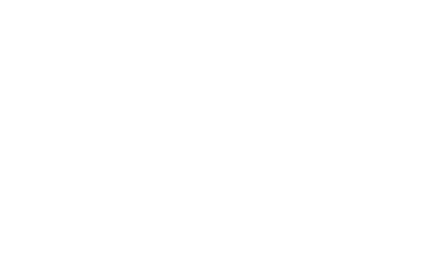

# ClearPlay

<p align="center">
  
</p>

<h1 align="center">WATCH WHAT YOU CAME FOR.</h1>

<p align="center">A privacy-first, distraction-free experience layer for online video.</p>

ClearPlay is a local-first Progressive Web App for intentionally chosen online video. Paste a supported link, watch in a focused interface, save it locally, resume later, or share a timestamped Moment.

The core loop is:

```text
PASTE -> WATCH -> FOCUS -> SAVE -> RESUME -> SHARE
```

ClearPlay is not a video hosting platform, downloader, stream proxy, DRM circumvention tool, credential collection service, or social network. The current playable integration is public, embeddable YouTube content through the supported YouTube player.

## Why ClearPlay

ClearPlay follows this product hierarchy:

> **CONTENT > ACTION > CONTEXT > CHROME**

The chosen content remains the center of the experience. Actions stay close to the player, useful context remains available, and surrounding interface chrome recedes.

## MVP

- Paste and Watch
- YouTube URL normalization
- Focus Mode
- Watch Later
- Continue Watching
- local History
- Playback Preferences
- installable PWA
- Moments
- responsive UI
- local-first storage

Smart Skip and the typed segment engine are present as extension points, but no segment-data provider is configured. Automatic skipping is therefore inactive unless a legitimate provider is added.

## Architecture

ClearPlay is an npm-workspaces monorepo:

- React and TypeScript provide the browser UI.
- Vite builds and serves the web application.
- `apps/web` contains the React application, feature modules, platform adapters, storage, public identity assets, manifest, and service-worker configuration.
- `packages/core` contains shared platform, player, metadata, chapter, and segment contracts.
- Feature-based modules cover home, player, history, Watch Later, Continue Watching, preferences, and Moments.
- Platform adapters isolate provider-specific detection, normalization, metadata, and player behavior.
- IndexedDB repositories store personal viewing state locally.
- `vite-plugin-pwa` generates the service worker and manifest integration.
- `apps/web/index.html` owns browser, Open Graph, Twitter/X, favicon, Apple, and theme metadata.

The application uses browser history and URL state rather than a routing dependency. `/watch?v=<video-id>&t=<seconds>` is the canonical viewing link; `/moment` uses the same video and timestamp parameters.

## Platform adapters

`PlatformAdapter` in [`packages/core/src/index.ts`](packages/core/src/index.ts) defines the boundary for:

- platform detection
- URL normalization
- metadata lookup
- player loading
- player lifecycle and cleanup
- optional segment metadata

YouTube is currently the only playable integration. Its adapter accepts supported public YouTube URL forms, normalizes them, obtains best-effort public oEmbed metadata, and loads the YouTube IFrame Player API. Other recognized platforms may receive an honest external-open message; recognition does not mean playback support.

## Local-first storage

ClearPlay currently does not require a ClearPlay backend for personal viewing records. IndexedDB stores are defined in [`apps/web/src/storage/db.ts`](apps/web/src/storage/db.ts) and accessed through the repository boundary:

| Store | Contents |
| --- | --- |
| `history` | Video metadata, duration, timestamp, and meaningful playback position |
| `watchLater` | Saved video metadata and save time |
| `continueWatching` | Resume position, duration, and update time |
| `preferences` | Theme, Focus Mode, autoplay, and skip preferences |

These records remain in the current browser profile until the user clears them or browser storage is removed. There is no claim of encryption, cloud sync, account synchronization, or server-side history in the current product.

## Moments

Moments use the URL shape:

```text
/moment?v=<video-id>&t=<seconds>
```

A Moment shares a timestamp in the same supported video. Opening it loads that video and seeks to the requested position. The share surface supports copying the link, native sharing where available, and saving a locally generated SVG share card. It does not upload video, host video, or create a clip on a ClearPlay server. The supplied `branding/moment-share.webp` asset remains available as official Moment/share branding; the current dynamic card is intentionally preserved.

## PWA and installation

ClearPlay is an installable PWA with a manifest, auto-updating service worker, precached application shell, official application icons, a maskable icon, and an Apple touch icon. Standalone display is requested where supported. The install prompt appears only when the browser provides `beforeinstallprompt`; on iOS Safari, the existing prompt provides the Share -> Add to Home Screen instructions. Video streams are not cached.

## Web identity and social metadata

The public identity layer is part of the product surface, not unused decoration.

### Browser identity

- title: `ClearPlay — Watch What You Came For.`
- description: `A privacy-first, distraction-free experience layer for online video.`
- official favicon ICO and 16, 32, 48, and 64 pixel PNG favicon set
- dark ClearPlay theme color

### PWA identity

- official 144, 192, 256, 384, and 512 pixel application icons
- separate 512 pixel maskable icon with `purpose: maskable`
- official Apple touch icon
- manifest name, short name, description, scope, start URL, theme, and background colors
- official loading and splash branding assets retained for browser/PWA contexts where a platform can use them

### Social identity

- Open Graph: `social/og-image-1200x630.png`
- Twitter/X large image card: `social/twitter-card-1200x675.png`
- LinkedIn artwork: `social/linkedin-1200x627.png` and `.webp`
- generic social-share artwork: `social/social-share-1200x630.png` and `.webp`

Open Graph remains the general browser-sharing metadata mechanism. No production URL is embedded because this repository does not define a deployment URL.

## Asset map

Important official assets currently integrated under `apps/web/public/`:

```text
apps/web/public/
├── branding/
│   ├── loading-screen.webp
│   ├── moment-share.webp
│   └── splash-screen.webp
├── favicon/
│   ├── favicon-16x16.png
│   ├── favicon-32x32.png
│   ├── favicon-48x48.png
│   └── favicon-64x64.png
├── logos/
│   ├── clearplay-header-logo.svg
│   ├── clearplay-logo-black.svg
│   ├── clearplay-logo-white.svg
│   └── clearplay-symbol.svg
├── pwa/
│   ├── apple-touch-icon.png
│   ├── icon-144.png
│   ├── icon-192.png
│   ├── icon-256.png
│   ├── icon-384.png
│   ├── icon-512.png
│   └── icon-maskable-512.png
└── social/
    ├── linkedin-1200x627.png
    ├── linkedin-1200x627.webp
    ├── og-image-1200x630.png
    ├── social-share-1200x630.png
    ├── social-share-1200x630.webp
    └── twitter-card-1200x675.png
```

`favicon.ico`, `favicon.svg`, the root Apple/PWA compatibility assets, and the existing SVG icon resources also remain in `apps/web/public/`. Dark surfaces use the white ClearPlay logo; light surfaces use the black logo. The header uses the official header lockup, and the footer switches between official white and black logo variants. Loading and splash images are retained as official assets because the current browser architecture has no native splash-screen hook that would justify inventing a delay or animation.

## Repository layout

```text
.
├── apps/
│   └── web/
│       ├── src/
│       │   ├── adapters/      # Platform registry and YouTube adapter
│       │   ├── components/   # Layout and install experience
│       │   ├── features/     # Home, player, library, Moments, preferences
│       │   └── storage/       # IndexedDB schema and repositories
│       └── public/            # Official identity, PWA, branding, and social assets
├── packages/
│   └── core/                  # Shared platform and player contracts
├── docs/                      # Product and MVP documentation
├── tests/
├── workers/
├── package.json
└── package-lock.json
```

## Development

Requirements are the declared root requirements: Node.js `>=24` and npm with the checked-in lockfile.

Run from the repository root:

```bash
npm run dev
npm run lint
npm run build
```

`npm run dev` starts the Vite development server for `apps/web`. `npm run build` type-checks the app, builds the web shell, and generates the PWA service worker.

### Development / Troubleshooting

The checked-in workspace uses the `workspace:*` dependency protocol for `@clearplay/core`. The current npm runtime available for this repository (`npm 11.19.0`) rejects that protocol during a fresh `npm install`, even though the workspace scripts run successfully with the existing installed dependencies. This is a repository bootstrap issue, not a runtime workaround. Do not edit application code merely to hide it; resolve package-manager compatibility or workspace dependency metadata before treating a clean npm install as supported.

## Engineering boundaries

ClearPlay improves the experience around supported video; it does not replace platform security or delivery systems. The repository does not implement DRM circumvention, protected-stream extraction, unauthorized downloading, stream proxying, credential collection, or server-side personal viewing records. A video may still be unavailable when its owner or platform disallows embedding.

The product intentionally preserves provider-specific player initialization, iframe communication, playback controls, timestamp seeking, Moment loading, and player lifecycle behavior behind the adapter boundary.

## Documentation

- [Product requirements](docs/PRD.md)
- [MVP traceability matrix](docs/MVP-TRACEABILITY.md)

ClearPlay is an MVP under active development. Multi-platform playback, provider-backed Smart Skip, and Smart Chapters are not currently implemented.

## License

No license file is present in this repository. Licensing is pending; do not assume permission to reuse, distribute, or contribute code beyond the rights granted by the repository owner.
